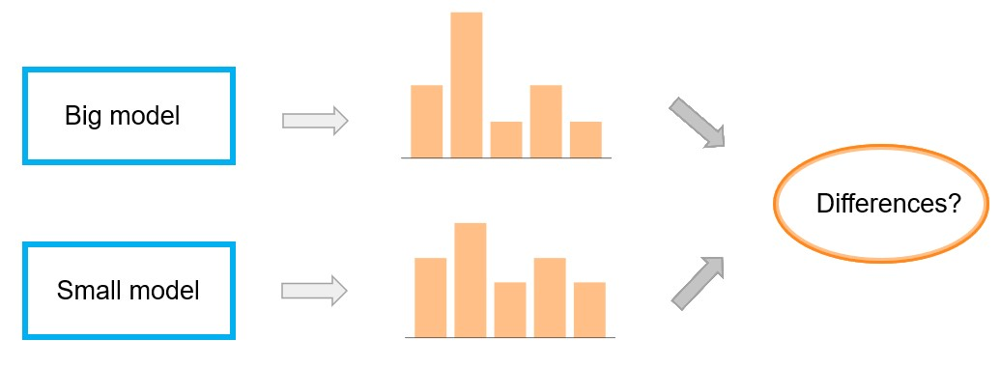
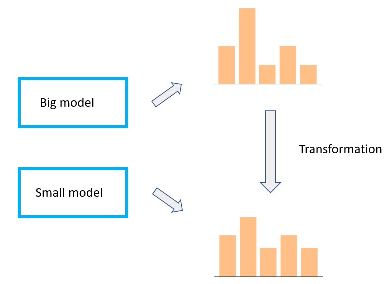

# Characterizing, classifying and transforming language model distributions

This is my completed master's thesis project. [Here is a link to it.](https://urn.kb.se/resolve?urn=urn:nbn:se:uu:diva-506668) The aim was to find explainable differences between the probability distributions output by generative language models of differen sizes:

Further, another aim of the project is to use these explainable differences to transform one model's distributions into another model's distributions (or at least to make them more similar):

